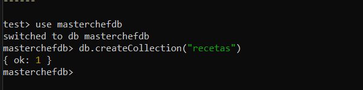
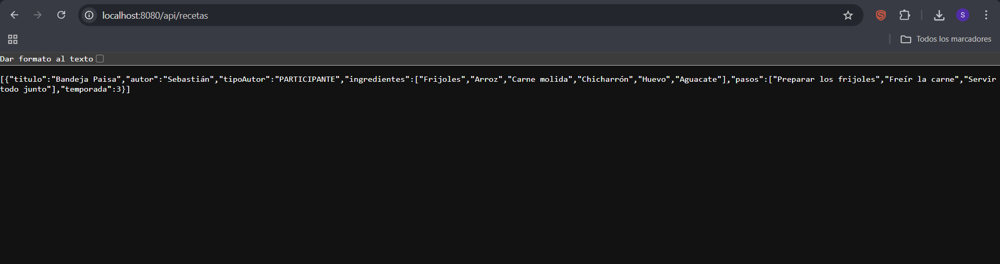
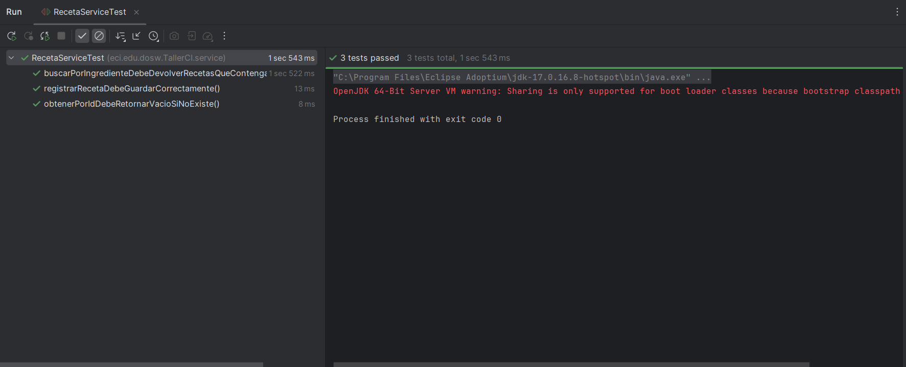
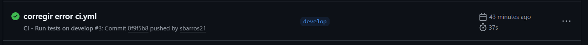
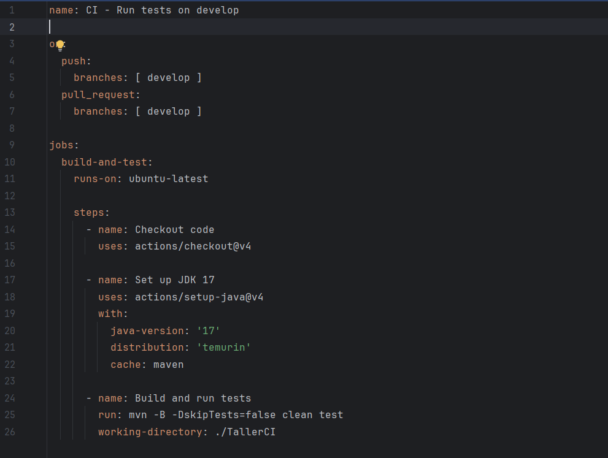
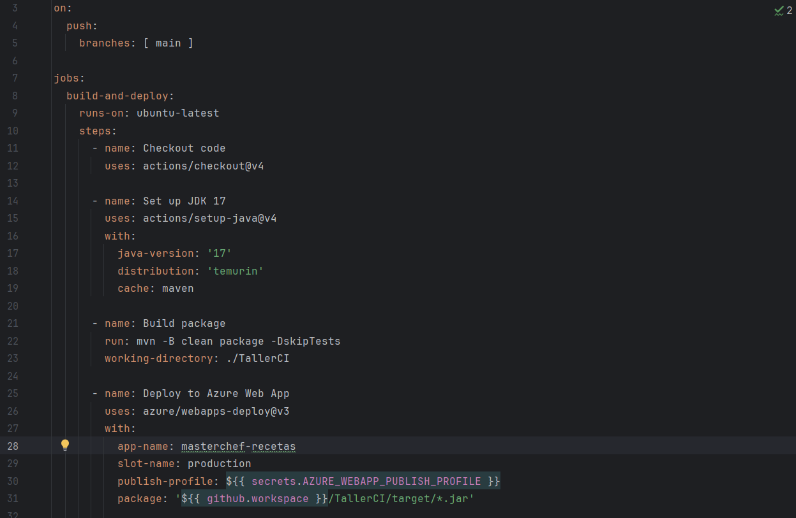
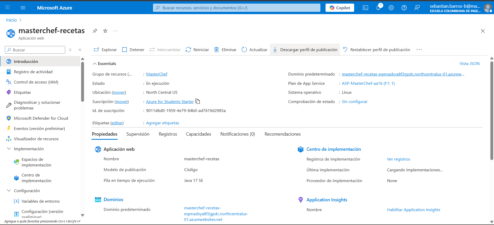
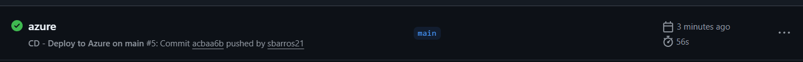
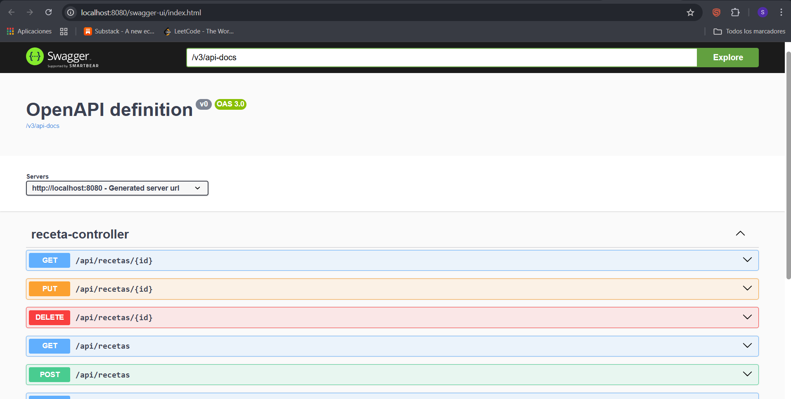

### TALLER CI/CD
------------------

CASO ESTUDIO MASTER CHEF CEEBRITY

En esta entrega del taller de CI/CD, desarrollé una API para la gestión de recetas del programa Master Chef.
La API permite realizar el CRUD para las recetas del programa, para distintos tipos de usuarios (audiencia, participantes, chefs).

Cuenta además con:

- Persistencia en MongoDB
- Swagger
- Pruebas unitarias con JUnit
- Integración continua y Despliegue continuo con GitHub Actions
- Despligue en Azure

Funcionalidades:
1.	Registrar una receta de un televidente
2.	Registrar una receta de un participante
3.	Registrar una receta de un chef
4.	Devolver todas las recetas guardadas
5.	Devolver cada receta por su Numero de consecutivo
6.	Devolver las recetas que hicieron participantes del programa
7.	Devolver las recetas que hicieron televidentes del programa
8.	Devolver las recetas que hicieron los chefs del programa
9.	Devolver las recetas por temporada 
10.	Buscar recetas que incluyan un ingrediente en especifico
11.	Eliminar una receta
12.	Actualizar una receta

Elementos de la Demo
--------------------

A. MongoDB

Crear la base de datos en MongoDB Compass

Probamos un POST por medio de Postman para crear una receta 

Lo vemos en el navegador por medio de LocalHost para verificar que se creo y que quedo guardado en la base de datos

B. Cree las tres pruebas que especifica en el enunciado, me enfoque en la logica, no en los endpoints asi que se hicieron
para el servicio. Evidencia:

C. Debe realizar CI/CD con Github Actions

a. ejecute las pruebas cada que haga push y pull request en develop

b. despliegue automaticamente cuando haga push a main

D. El acceso a swagger esta en este link luego de correr la apliación: http://localhost:8080/swagger-ui/index.html

