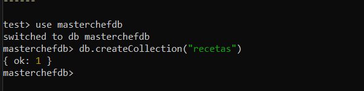
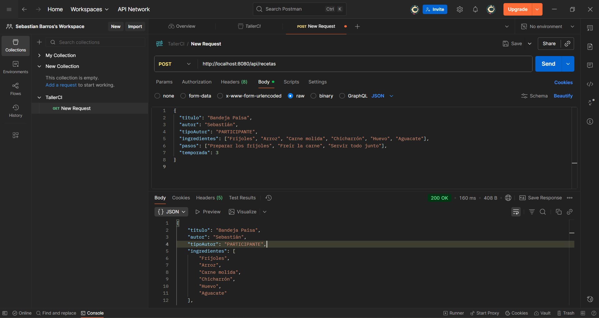
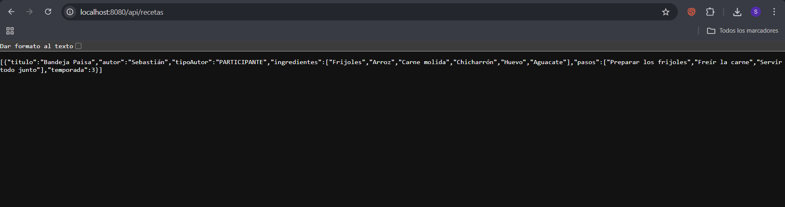
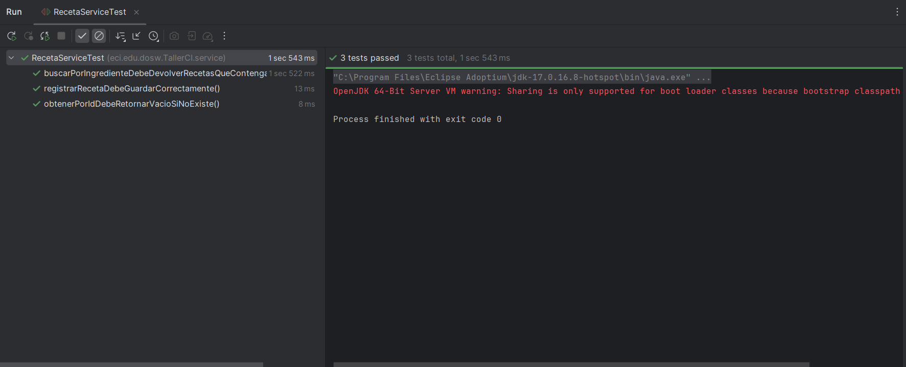
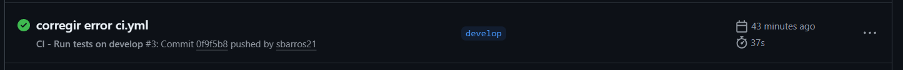
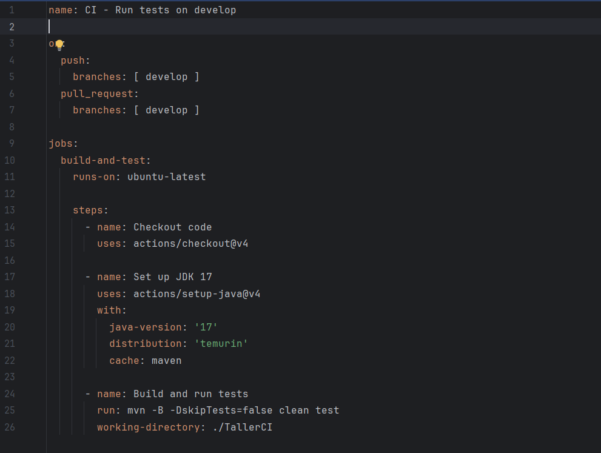
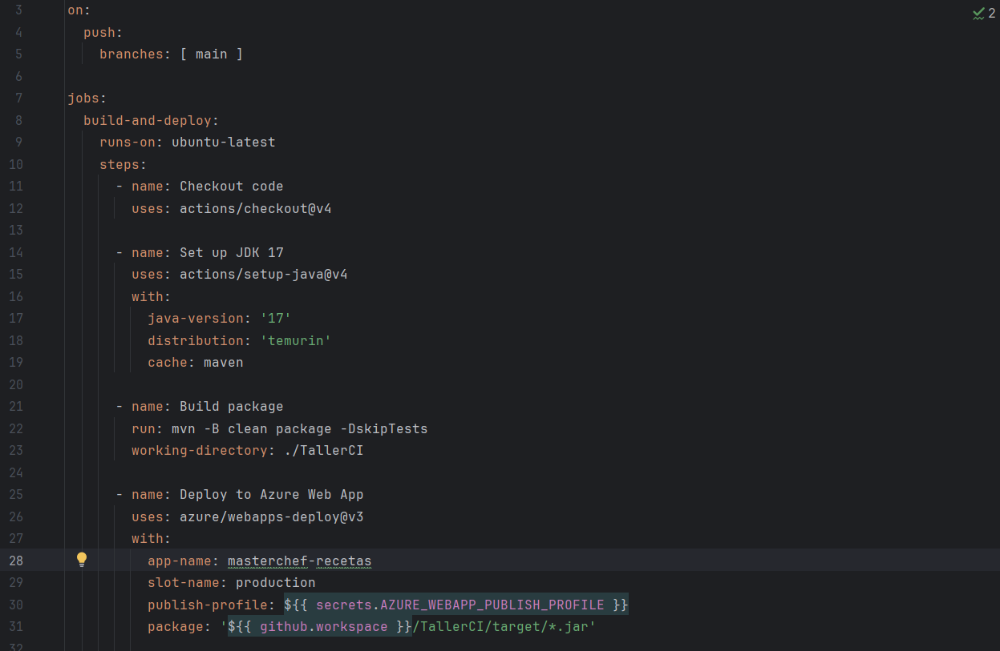
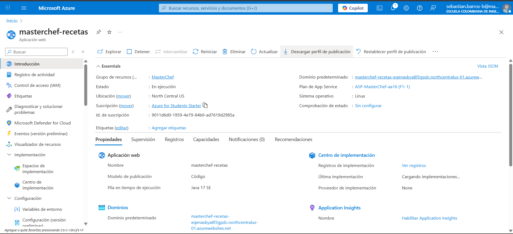
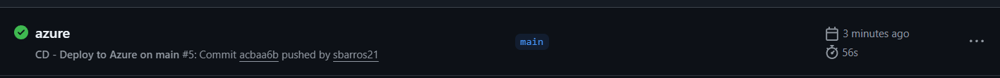

### TALLER CI/CD

A. MongoDB

Crear la base de datos en MongoDB Compass

Probamos un POST por medio de Postman para crear una receta 

Lo vemos en el navegador por medio de LocalHost para verificar que se creo y que quedo guardado en la base de datos

B. Cree las tres pruebas que especifica en el enunciado, me enfoque en la logica, no en los endpoints asi que se hicieron
para el servicio. Evidencia:

C. Debe realizar CI/CD con Github Actions

a. ejecute las pruebas cada que haga push y pull request en develop

b. despliegue automaticamente cuando haga push a main

D. El acceso a swagger esta en este link luego de correr la apliación: http://localhost:8080/swagger-ui/index.html